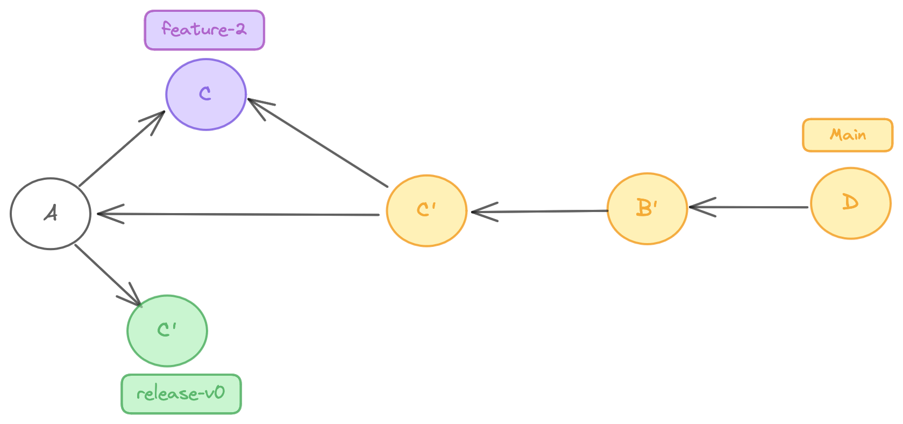
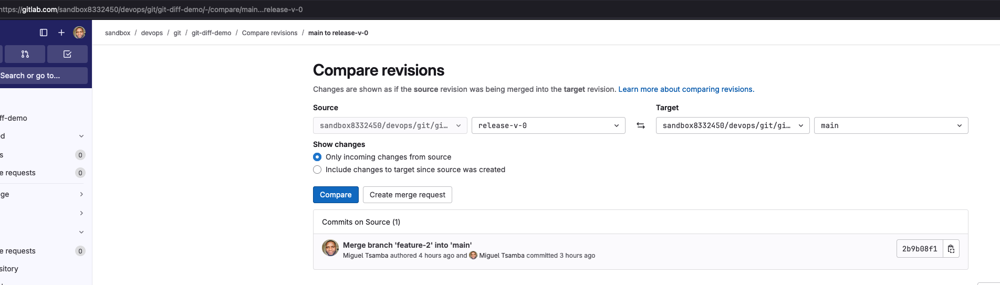

# Git diff demo

The goal of this projet is a basic example that aims to understand git diff command(focus on two and three dot) A..B and A...B. And thus view how git host repository interprets it(Focus on github and gitlab)


## Git basics

We have the notion of ranges. That is representby two and three dot. It can be apply both on git log and git diff, but we different goals.

### Log

> In this example 1 and 2 can be commit, branch or tag.

```shell
git log 1..2
```

* It means log commits ***on 2 that is not in 1*** from the common ancestor.


```shell
git log 1...2
```

* It means log commits that is not both ***on 1 AND on 2***. Every commit that in A and B does not appear.


> On image the red space will not be log.


### Diff

> In this example 1 and 2 can be commit, branch or tag.

```shell
git diff 1..2
```
* It means show last change difference between 1 and 2, base on 2. So **changes both made in 1 and 2 but in perspective on 2**

.png)

```shell
git diff 1...2
```

* It means show only changes from 2 with common ancestor of 1 and 2. So **changes only appears on 2 since 2 has diverge from A(Usually for Pull/Merge request).

.png)


> On image just white commit C0' and 2 appears. 


## Setup 

### Remotes

* For host repository behaviour please create two reposiotry, one on Github and another on Gitlab

```shell
git remote set-url --add --push origin [gitHubURLRepo]
git remote set-url --add --push origin [gitlabURLRepo]
```

### Init on main branch

* Create on main branch a README.md file
* Just commit it 
* Push on both host(Github and gitlab)

```shell
git switch -c [custombranch] # Here is master
echo "First commit with readme" > README.md
git add . && git commit -m "Initial commit.(A)"
git push -u origin [custombranch] 
```

### Create first feature branch

#### Setup 

* This branch add 3 changes
    * In README.md
    * Create directory and:
        * New file feature-1.txt with random text
        * New image for explanation(master_with_feature_1)

* The commit message is 'feature 1(B)'

```shell
git switch -c feature-1 
mkdir -p feature-1
echo "First commit with readme" | tee README.md feature-1/feature-1.txt
mv [anImage] feature-1
# Add every number of commit you want, in y case i made 
git add . && git commit -m "feature 1(B)"
git push -u origin feature-1 
```

At this stage we can represent what we have done:


#### Analyze two dot diff/log use-case

| Host   | git log main..feature-1                                   | git diff main..feature-1             | Comments                  |    
| ------ |                  ------                                   |                 ------               | ------                    |
|  Gitlab | Expected behaviour: ✅        |                 Expected behaviour: ✅             | - We see exact 3 commits like git command on shell <br> - We remark a thing on radio button we need to select *Include changes to target since source was created*  <br> - The URL contains nomenclature main..main..feature-1 <br> - ⚠️ We have a none intuitive stuff before version 16.2(Just 'resolve' at last year.), [see all interesting conversations about that](https://gitlab.com/gitlab-org/gitlab/-/issues/377957) <br> - In my opinion I feel happy Gitlab team take a time to design a better solution. Although we have a mental modal to map the notion of(source and target) and URL that have git command(A..B)   |
| Github | Expected behaviour: ⛔️        |     Expected behaviour:  ✅           |  - We also have same 3 commits log like both shell and gitlab <br> - We have a subtility here with notion of *base* and URL contains three dot by default <br> - Note that we see code in red in difference, it is in master and not feature-1, and code in green it is the inverse. <br> - We can change the URL with two dot to see result and we see that GH does not display commit and does not support this feature in UI as Gitlab does. We need to explicit add on URL |
| local     | Expected behaviour: ✅        |    Expected behaviour: ✅     and   |     - We see all files that have add and change(9) <br> - In my opinion git have inconstency between log and diff in internal system with range. I feel confident with this [comment on maintainer of git](https://gitlab.com/gitlab-org/gitlab/-/merge_requests/104175#note_1181397081) that confirm that assertion and all confusion |


#### Analyze three dot diff/log use-case

* We create a branch ``feature-2`` at the same time we basic change just to add another commit on master(we keep no-fast forward merge stratey)
* So in master we have two new commits that diverge from ``feature-1``. 

We can see it like that:


So C' is the merge commit that have children C(Commit from feat-2) and previous HEAD(initial commit A).

At this point we see that commit A (white) is the common ancestor between `main` and `feature-1`, but all color's commit is for each branch.

Let's try to play with three dot Analyze

| Host   | git log main...feature-1                                   | git diff main...feature-1             | Comments                  |    
| ------ |                  ------                                   |                 ------               | ------                    |
|  Gitlab | Expected behaviour: ❌        |                 Expected behaviour: ✅             | - (log)We just 3 commits like(..), tha's not match git standard.This would output 5! <br> -(diff) We have just one change like expected. If we see branch main we have tipo that fixe some stuff on feature-2. It can be unintuitive because UI does not show it. It because comparison it against last commit on release and common base(before fix)  <br> - In my opinion I feel happy Gitlab team take a time to design a better solution. Although we have a mental modal to map the notion of(source and target) and URL that have git command(A..B)   |
| Github | Expected behaviour: ❌        |     Expected behaviour:  ✅           |  - (log)We also have same 3 commits log like Gitlab and git command <br> - (diff) Just one change like expected  |
| local     | Expected behaviour: ✅        |    Expected behaviour: ✅     and   |     - (log) We have 5 commits, 2 from `main` and 3 from `feature-1`. As expected we don't have common commit A. <br> (log)This log it's not very useful because it see just commit for both branches |


#### Analyze special case when rebasing feature-1

* At this start if we rebase feature-1 and main, all two and three dot produces same output.

* Reminder that rebase change common-base, and HEAD on main become this base. So diff in both case compare last commit on `main` with last commit on `feature-1`


#### Analyze cherry-pick

* Imagine we want to cherry-pick a commit from a new release branch(base on main) and compares with

```shell
# merge feat-1 on main

git switch main && git merge feature-1

## At this point we have a merge commit D
```


```shell
# Create a release branch from main(initial commit A) and just want to pick commit C'(merge from feat-2)

git switch main && git log --oneline (Pick commit hash)

git switch -c release [hashCommit (A)]

git cherry-pick 1 [hashCommit (C')]

```

* At this point our release only contains A and C', main does not change , it has A, C, B' and D



* Pay attention release branche just because it cherry-pick, hash of commit C change and tree also. It appears strange that when we apply git diff between main, this change appears.

| Host   | git log main...release-v-0                                   | git diff main...release-v-0                | Comments                  |    
| ------ |                  ------                                   |                 ------               | ------                    |
|  Gitlab | Expected behaviour: ⚠️ partial        |                 Expected behaviour: ✅             | - (log)We have 1 commit (but gitlab add precision on source) but not display commit on target. So it partial correct like git command. <br> - (log)If we toggle and try ``release-v-0`` as target, we can see the 4 commit that we miss.  <br> -(diff)  <br> - ⚠️ |
| Github | Expected behaviour: ❌        |     Expected behaviour:  ✅           |  - (log)We have just one commit. And we don't have others 4 commits. Seems Github have same behaviour like Gitlab. But UI does not precise commit on **target**<br> -(log) Unexpected if we toggle , just have 2 commits from `main`, we miss 2 commits <br>(diff) We also have 17 files changes like both gitlab and git command  |
| local     | Expected behaviour: ✅        |    Expected behaviour: ✅     |     - (log) We have 5 commits, (4 commits  from `main`) and 1 from `release-v-0`. Here the commit appears like it not in main because it's new commit that cherr-pick brings.  <br> (log)This log it's not very useful because it see just commit for both branches <br> -(diff)We have just one change that appears because here we just take commit on `release-v-0` and compare to common ancestor that is just this modification. If we commit on master and change this text to *Some functionnality for feature-2 that is not on release!(very bad)  we see same output* <br> - (log/diff)In my opinion git have inconstency between log and diff in internal system with range. I feel confident with this [comment on maintainer of git](https://gitlab.com/gitlab-org/gitlab/-/merge_requests/104175#note_1181397081) that confirm that assertion and all confusion |


